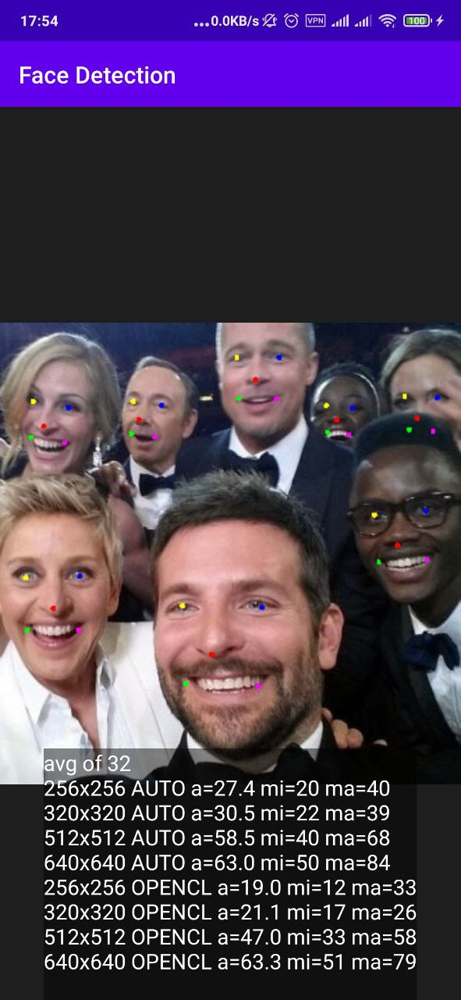

# Android face detection with landmarks

Used framework – [MNN by Alibaba](https://github.com/alibaba/MNN);

Model was taken from [biubug6/Face-Detector-1MB-with-landmark (RFB)](github.com/biubug6/Face-Detector-1MB-with-landmark);

Then converted with [built docker image MNNConvert](https://github.com/gordinmitya/docker_that_framework/tree/master/mnn);

Face bounding box + landmarks: eyes, nose, mouth.

## Example

Execution time ~20ms for image 320x320 on Snapdragon 855 (including pre and postprocessing).

## Notes

If you're going to obfuscate with Proguard don't forget to [include these rules](./app/proguard-rules.pro) to keep Face class. It's used from JNI.

There're alternatives like [TFLite with Blazeface](https://github.com/google/mediapipe).